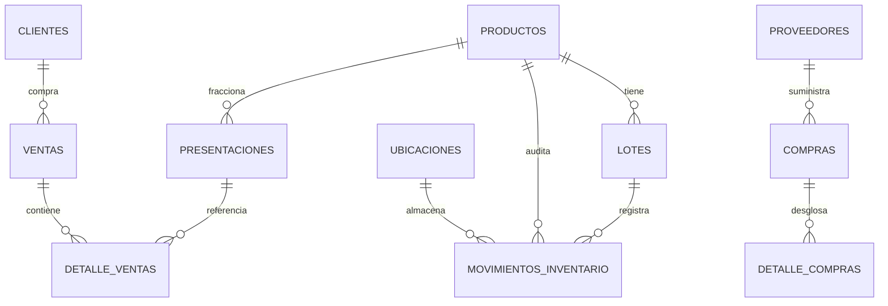

# 🌾 Agrovet Campo Alto — Resumen Técnico del Proyecto

**Sistema Integral de Punto de Venta (POS), Control de Lotes FEFO e Inventario Multi-Ubicación para Agroveterinarias**

---

## 📌 1. Descripción General
**Agrovet Campo Alto** es una plataforma web desarrollada para solventar los retos operativos específicos del sector agropecuario y veterinario:
- **Fraccionamiento de productos:** Venta por dosis, mililitros, gramos, libras o presentaciones completas (litros, sacos, frascos).
- **Gestión de caducidades con FEFO (*First Expired, First Out*):** Despacho prioritario de lotes más próximos a vencer.
- **Inventario Multi-Ubicación:** Separación estricta entre *Bodega Central* (almacén de recepción) y *Área de Venta* (punto de despacho del POS) con traslados atómicos.
- **Punto de Venta (POS):** Cobro ágil en múltiples formas de pago (efectivo, transferencias, créditos), cálculo de vuelto e impresión de comprobantes.
- **Gestión de Clientes & Crédito:** Registro de clientes, límites de crédito, saldos pendientes e historial de abonos.
- **Cierre y Arqueo de Caja:** Apertura de turno, conciliación de montos recaudados y corte de turno.
- **Compras y Proveedores:** Entrada de mercancía a bodega con actualización de costos unitarios y registro de números de lote.

---

## 🛠️ 2. Stack Tecnológico

| Componente | Tecnología | Descripción / Propósito |
| :--- | :--- | :--- |
| **Frontend Core** | HTML5 + JavaScript ES6+ (ESM) | Arquitectura modular nativa sin herramientas de compilación pesadas, facilitando mantenimiento y despliegues ligeros. |
| **Estilos & UI** | Tailwind CSS (CDN) + Vanilla CSS | Sistema de diseño de alta gama con soporte para **Modo Oscuro / Modo Claro** con persistencia en `localStorage`, **Glassmorphism**, y paleta temática *Forest & Emerald*. |
| **BaaS / Backend** | Supabase (PostgreSQL 15+) | Base de datos relacional, autenticación de usuarios (Supabase Auth), Row Level Security (RLS), vistas materializadas y funciones almacenadas (PL/pgSQL). |
| **Cliente de BD** | `@supabase/supabase-js` (v2 vía ESM CDN) | Comunicación asíncrona segura mediante tokens JWT. |
| **Tipografía & Assets** | Google Fonts (`Plus Jakarta Sans`, `Inter`) | Tipografía moderna de alta legibilidad para terminales POS e interfaces administrativas. |

---

## 🏛️ 3. Arquitectura de Base de Datos y Lógica de Negocio

El modelo de datos y las funciones transaccionales se gestionan mediante migraciones SQL en [`supabase/`](../supabase):



### Principales Reglas y Mecanismos de Backend:

1. **Control de Acceso Basado en Roles (RLS):**
   - Tabla `perfiles` ligada a `auth.users`.
   - **`admin`**: Acceso completo (costos de productos, compras, reportes, usuarios, auditoría Kardex).
   - **`vendedor`**: Acceso limitado a terminal POS, consulta y creación de clientes, y arqueo de caja de su propio turno.
2. **Fraccionamiento de Productos (`productos` y `presentaciones`):**
   - Cada producto define su `unidad_base` (ej. `ml`, `gramos`, `dosis`, `unidad`).
   - Cada presentación define un `factor_conversion` respecto a la unidad base (ej. *Frasco 1 Litro* = factor 1000; *Jeringa 5 ml* = factor 5).
3. **Despacho Automático FEFO (`procesar_salida_fefo`):**
   - Función PL/pgSQL que deduce el stock consumido en una venta priorizando los lotes con fecha de caducidad más cercana que se encuentren físicamente en el *Área de Venta*.
4. **Inventario Multi-Ubicación y Traslados Atómicos (`realizar_traslado_inventario`):**
   - Ubicaciones por defecto:
     - `11111111-1111-1111-1111-111111111111`: **Bodega Central** (`almacenamiento`).
     - `22222222-2222-2222-2222-222222222222`: **Área de Venta** (`punto_venta`).
   - Genera transacciones atómicas de salida e ingreso vinculadas por un `traslado_id`.
   - Vistas dinámicas `v_stock_lotes_ubicacion` y `v_stock_productos_ubicacion` con alertas de stock mínimo (`stock_minimo_ubicacion`).
5. **Kardex y Auditoría Continua (`movimientos_inventario`):**
   - Registra todo movimiento: `ENTRADA_COMPRA`, `SALIDA_VENTA`, `TRASLADO_SALIDA`, `TRASLADO_ENTRADA`, `AJUSTE_POSITIVO`, `AJUSTE_NEGATIVO`, `MERMA_VENCIDO`.

---

## 📂 4. Estructura de Módulos del Proyecto

```
agroveterinaria-app/
│
├── README.md                            # Resumen técnico y documentación principal
├── docs/
│   └── RESUMEN_TECNICO.md               # Copia del resumen técnico para consulta rápida
│
├── src/
│   ├── index.html / app.js              # Inicio de sesión, autenticación y enrutamiento por rol
│   │
│   ├── [MÓDULOS DE ADMINISTRADOR]
│   ├── admin.html / admin.js            # Dashboard general y KPIs de rendimiento
│   ├── inventario.html / inventario.js  # Catálogo de productos, presentaciones, lotes y traslados
│   ├── kardex.html / kardex.js          # Auditoría completa de movimientos de inventario
│   ├── pos.html / pos.js                # Punto de Venta (Versión Administrador)
│   ├── compras.html / compras.js        # Registro de compras a proveedores e ingreso a bodega
│   ├── clientes.html / clientes.js      # Gestión de clientes, líneas de crédito y abonos
│   ├── cierre.html / cierre.js          # Arqueo de caja y cierres de turno completos
│   ├── facturacion.html / facturacion.js# Facturación manual y vinculación con documentos SAT
│   ├── empleados.html / empleados.js    # Administración de usuarios y roles
│   │
│   ├── [MÓDULOS DE CAJERO / VENDEDOR]
│   ├── cajero-home.html / cajero-home.js        # Panel simplificado para vendedor
│   ├── cajero-pos.html / cajero-pos.js          # POS optimizado (restringido al Área de Venta)
│   ├── cajero-clientes.html / cajero-clientes.js# Consulta rápida de clientes y crédito
│   ├── cajero-cierre.html / cajero-cierre.js    # Arqueo de caja del turno del cajero
│   │
│   ├── assets/                          # Logotipos y recursos gráficos
│   └── test_*.js                        # Scripts de prueba y validación de inventario/traslados
│
└── supabase/                            # Migraciones y scripts SQL ordenados cronológicamente
    ├── 01_schema_inicial.sql
    ├── 02_roles_y_seguridad.sql
    ├── 03_cierres_caja.sql
    ├── 04_kardex_fefo.sql
    ├── 05_clientes_credito.sql
    ├── 06_ventas_credito_cliente.sql
    ├── 07_proveedores_compras.sql
    ├── 08_fix_rls_recursion.sql
    ├── 09_tres_capas_impuestos_y_reportes.sql
    ├── 10_separar_medicion_presentaciones.sql
    └── 11_inventario_multi_ubicacion.sql
```

---

## ⚡ 5. Fortalezas Operativas y de Seguridad

1. **Cero Desfases de Stock Físico vs. Virtual:** La separación entre *Bodega* y *Área de Venta* impide que un cajero venda mercancía que aún está guardada o embalada en bodega sin haber sido trasladada.
2. **Cero Mermas por Vencimiento Imprevisto:** El algoritmo FEFO asegura que el primer lote en vencer sea el primero en descontarse al cobrar.
3. **Resiliencia e Integridad Transaccional:** Al estar implementadas las transacciones críticas directamente en PostgreSQL (`SECURITY DEFINER`), se evitan estados inconsistentes por desconexiones o fallos en el navegador del cliente.
4. **Experiencia de Usuario:** Interfaz rápida, soporte para lectores de código de barras, atajos de teclado e impresión de tickets.
